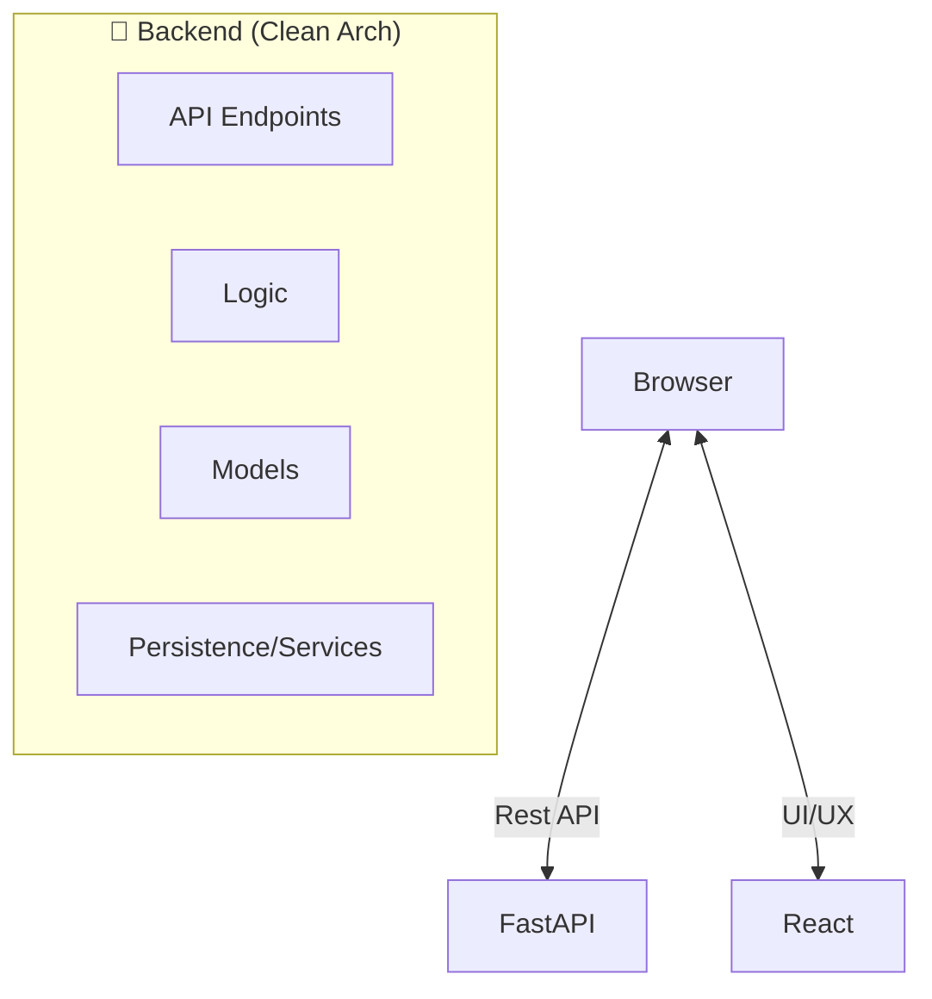

# 🏛️ Graphite & Bronze: Full-Stack Engineering Portfolio

[](LICENSE)
[](https://github.com/Argenis1412/portfolio/actions)
[](https://github.com/Argenis1412/portfolio/actions)
[](https://www.python.org/downloads/)
[](https://react.dev/)

> **A technical showcase featuring a FastAPI (Python) backend and a React (TypeScript) frontend, organized with Clean Architecture and a professional "Graphite & Bronze" aesthetic.**

This project serves as a practical implementation of modular design, automated testing, and modern UI/UX patterns.

---

## 🛠️ Tech Stack & Key Features

- **Backend**: FastAPI with Pydantic V2 validation, structured logging (`structlog`), and request-id tracking.
- **Frontend**: React (Vite) with TailwindCSS, featuring hardware-accelerated transitions and responsive design.
- **Architecture**: **Clean Architecture** (Separation of Concerns: Controllers → Use Cases → Domain → Infrastructure).
- **Automation**: GitHub Actions CI/CD for automated testing (Python/Pytest) and linting.
- **Reliability**: ~93% backend test coverage with isolated business logic.

---

## 🚀 Step-by-Step Installation

Follow these steps to get the project running locally.

### 1. Clone the Repository
```bash
git clone https://github.com/Argenis1412/portfolio.git
cd portfolio
```

### 2. Configure the Backend (FastAPI)
The backend manages data via JSON files, eliminating the need for a database setup.
```bash
cd backend
# Create and activate virtual environment
python -m venv .venv
source .venv/bin/activate  # Linux/Mac
# or: .venv\Scripts\activate on Windows

# Install dependencies and start server
pip install -r requirements.txt
uvicorn app.principal:app --reload
```
- API will be at: `http://localhost:8000`
- Docs (Swagger): `http://localhost:8000/docs`

### 3. Configure the Frontend (React)
```bash
cd ../frontend
npm install
npm run dev
```
- Frontend will be at: `http://localhost:5173`

### 🐳 Using Docker (Optional)
Run the entire stack with a single command:
```bash
docker-compose up --build
```

---

## 🏗️ Architecture Layout



---

## 📁 Repository Structure
- `backend/`: FastAPI implementation, schemas, and unit tests.
- `frontend/`: React components, custom hooks, and "Graphite & Bronze" CSS system.
- `.github/workflows/`: CI/CD pipelines for automated quality checks.
- `docker-compose.yml`: Container orchestration for simplified deployment.

---

## 👨‍💻 Author: Argenis Lopez
**Backend Developer**

- 💼 [LinkedIn](https://www.linkedin.com/in/argenis972/)
- 🐙 [GitHub](https://github.com/Argenis1412)

---
*Built with focus on performance, clean patterns, and a refined industrial look.*
 License

This project is licensed under the **MIT License** - see the [LICENSE](LICENSE) file for details.

---

## 👨‍💻 Author

**Argenis Lopez**

- 💼 LinkedIn: [LinkedIn](https://www.linkedin.com/in/argenis972/)
- 🐙 GitHub: [Argenis1412](https://github.com/Argenis1412)
