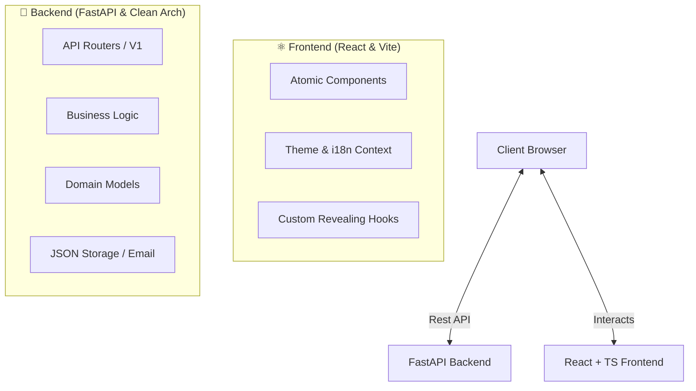

# 🏛️ Graphite & Bronze: Professional Engineering Portfolio

[](LICENSE)
[](https://www.python.org/downloads/)
[](https://react.dev/)
[](https://fastapi.tiangolo.com)

> **A high-end engineering showcase built with Python (FastAPI) and React (TypeScript), featuring Clean Architecture and a sophisticated Graphite & Bronze aesthetic.**

This repository demonstrates a production-grade approach to personal branding, emphasizing architectural precision, automated testing, and a premium user experience.

---

## 🎨 Aesthetic: Graphite & Bronze
Inspired by high-level engineering tools like Linear and Vercel, the portfolio uses a neutral, matte palette designed to project maturity and professional stability.
- **Modo Oscuro (Graphite)**: A non-flickering stone-gray (#121212) base with sophisticated bronze accents.
- **Modo Claro (Cloud)**: A smoky paper-gray (#F5F5F3) for reduced eye strain and maximum readability.
- **Interactive Lighting**: Dynamic "Aro de Luz" (bronze glows) and subtle hardware-accelerated transitions.

---

## 🏗️ Architecture & Technology

### System Overview
The project is built on **Clean Architecture** principles, ensuring that business logic remains independent of frameworks and external UI components.



### Technical Excellence
- **Frontend**: Vite-powered React with TailwindCSS (V4 compatible architecture), smooth reveals, and hardware-accelerated animations.
- **Backend**: FastAPI with strict Pydantic V2 validation, structured logging (`structlog`), and request-id tracking.
- **Testing**: Robust test suite with **93.05% code coverage**, ensuring every business rule is validated.
- **DevOps**: Docker-ready with multi-stage builds and GitHub Actions CI/CD.

---

## 📁 Project Structure

```bash
portfolio/
├── 🚀 backend/          # Python API (Clean Architecture)
│   ├── app/            # Source code (Core, Controllers, UseCases, Entities, Adapters)
│   ├── dados/          # JSON Persistence (Zero-infrastructure data storage)
│   └── testes/         # Automated unit and integration tests
├── ⚛️ frontend/         # React Application
│   ├── src/            # Components, Hooks, Contexts, and modern CSS
│   └── public/         # Optimized assets
└── ⚙️ docker-compose.yml # Container orchestration
```

---

## 🚀 Quick Setup

### Prerequisites
- Python 3.12+
- Node.js 20+

### 1. Backend Initialization
```bash
cd backend
python -m venv .venv
source .venv/bin/activate # or .venv\Scripts\activate on Windows
pip install -r requirements.txt
uvicorn app.principal:app --reload
```

### 2. Frontend Initialization
```bash
cd frontend
npm install
npm run dev
```

---

## 👨‍💻 Author: Argenis Lopez
**Backend Developer & Systems Student at UFPR**

Focused on building secure, scalable, and high-performance backend systems with hexagonal architecture and deterministic financial logic.

- 💼 [LinkedIn](https://www.linkedin.com/in/argenis972/)
- 🐙 [GitHub](https://github.com/Argenis1412)

---
*Developed with precision and a focus on architectural integrity.*
 License

This project is licensed under the **MIT License** - see the [LICENSE](LICENSE) file for details.

---

## 👨‍💻 Author

**Argenis Lopez**

- 💼 LinkedIn: [LinkedIn](https://www.linkedin.com/in/argenis972/)
- 🐙 GitHub: [Argenis1412](https://github.com/Argenis1412)
