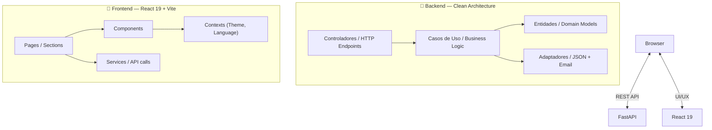

# 🏛️ Graphite & Bronze: Full-Stack Engineering Portfolio

[](LICENSE)
[](https://github.com/Argenis1412/portfolio/actions)
[](https://github.com/Argenis1412/portfolio/actions)
[](https://www.python.org/downloads/)
[](https://react.dev/)

> **A personal portfolio built as a full-stack engineering project — featuring a FastAPI (Python) backend and a React 19 (TypeScript) frontend, organized with Clean Architecture and a refined "Graphite & Bronze" aesthetic.**

The goal of this project is not only to showcase my work, but also to demonstrate how I think and build software: with clean structure, automated tests, and attention to the user experience. The backend serves all portfolio data (projects, experience, stack, about me) through a versioned REST API, while the frontend consumes it and presents it with smooth animations and full i18n support (PT, EN, ES).

---

## 🛠️ Tech Stack & Key Features

| Layer | Technology |
|---|---|
| **Backend** | FastAPI · Pydantic V2 · structlog · slowapi |
| **Frontend** | React 19 · TypeScript · Vite · Tailwind CSS v4 |
| **Testing** | Pytest (backend) · Vitest + Testing Library (frontend) |
| **CI/CD** | GitHub Actions (lint + test on every push) |
| **Data** | JSON files (no database needed) |
| **Deployment** | Docker Compose · Railway / Render compatible |

- **Architecture**: Clean Architecture (Controllers → Use Cases → Entities → Adapters).
- **i18n**: All content served in PT / EN / ES simultaneously from the API.
- **91% backend test coverage** with fully isolated business logic (90.55% measured — 19 tests, all passing).
- **Contact form** forwarded via Formspree (no server-side email setup required).

---

## 🚀 Step-by-Step Installation

### 1. Clone the Repository
```bash
git clone https://github.com/Argenis1412/portfolio.git
cd portfolio
```

### 2. Configure the Backend (FastAPI)
The backend reads data from JSON files — no database setup needed.
```bash
cd backend

# Create and activate virtual environment
py -3.12 -m venv .venv       # Windows (recommended)
# or: python -m venv .venv

.venv\Scripts\activate        # Windows
# or: source .venv/bin/activate  # Linux/Mac

# Install dependencies
pip install -r requirements.txt

# (Optional) Configure environment variables
cp .env.exemplo .env
# Edit .env to set FORMSPREE_FORM_ID for contact form

# Start the server
uvicorn app.principal:app --reload
```
- API: `http://localhost:8000`
- Interactive Docs (Swagger): `http://localhost:8000/docs`

### 3. Configure the Frontend (React)
```bash
cd frontend
npm install
npm run dev
```
- Frontend: `http://localhost:5173`

> The frontend reads `VITE_API_URL` from the environment. In development it defaults to `http://127.0.0.1:8000/api/v1`.

### 🐳 Using Docker (Optional)
Run the entire stack with a single command:
```bash
docker-compose up --build
```

---

## 🧪 Running Tests

### Backend
```bash
cd backend
# Standard (with venv active)
pytest

# With coverage report
pytest --cov=app --cov-report=html

# Quick shortcut (Windows — no activation needed)
.\test
```

### Frontend
```bash
cd frontend
# Run tests once
npm run test

# Or in watch mode
npx vitest
```
The frontend uses **Vitest** + **@testing-library/react** with a `jsdom` environment. Tests live in `src/tests/`.

---

## 🏗️ Architecture Layout



---

## 📁 Repository Structure
```
portfolio/
├── backend/          # FastAPI backend (Clean Architecture)
├── frontend/         # React 19 + TypeScript frontend
├── .github/          # GitHub Actions CI/CD workflows
├── docker-compose.yml
├── railway.toml      # Railway deployment config
└── render.yaml       # Render deployment config
```

For detailed information about each part, see:
- [`backend/README.md`](backend/README.md)
- [`frontend/README.md`](frontend/README.md)

---

## 👨‍💻 Author

**Argenis Lopez** — Backend Developer

- 💼 [LinkedIn](https://www.linkedin.com/in/argenis972/)
- 🐙 [GitHub](https://github.com/Argenis1412)

---

This project is licensed under the **MIT License** — see the [LICENSE](LICENSE) file for details.
