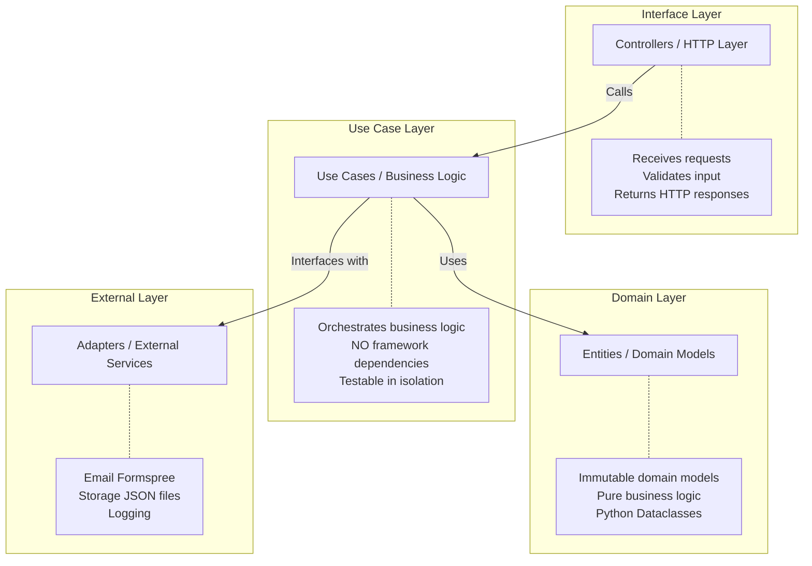

# 🎯 Portfolio Backend API

REST API developed with **FastAPI** following **Clean Architecture** to demonstrate backend development best practices in Python.

## 📝 Description

Professional backend for a developer portfolio, implementing:
- ✅ **Clean Architecture** (Controllers → Use Cases → Entities → Adapters)
- ✅ **Versioned API** (/api/v1/*)
- ✅ **Global Error Handling** with custom exceptions
- ✅ **Middleware** with request_id, logging, and performance measurement
- ✅ **Professional Health Check** with uptime and version info
- ✅ **Clear separation** of responsibilities
- ✅ **Automatic validation** with Pydantic V2
- ✅ **Interactive Documentation** with OpenAPI/Swagger
- ✅ **Automated Tests** with pytest (89%+ coverage)
- ✅ **Full Type Hints** (mypy strict compatible)
- ✅ **Layered contact protection** with honeypot, spam scoring, rate limiting, idempotency, and deduplication

---

## 🏗️ Architecture

### Simplified Clean Architecture


### Request Flow

1. HTTP Request
2. Middleware (adds request_id, logs entry)
3. Controller (Pydantic validation)
4. Use Case (executes logic)
5. Adapter (accesses data/external services)
6. Returns Response
7. Middleware (logs exit, adds headers)
8. Client receives response + X-Request-ID + X-Response-Time

---

## 📂 Folder Structure

```
backend/
├── app/
│   ├── principal.py              # FastAPI Application
│   ├── configuracao.py           # Configuration (pydantic-settings)
│   │
│   ├── core/                     # 🔷 Cross-cutting Concerns
│   │   ├── excecoes.py           # Custom exceptions
│   │   ├── handlers.py           # Global error handlers
│   │   ├── honeypot.py           # Hidden-field bot trap
│   │   ├── idempotencia.py       # Replay protection + duplicate cache
│   │   ├── middleware.py         # Request ID, logging, timing
│   │   ├── limite.py             # Rate limiting configuration
│   │   └── spam_check.py         # Heuristic spam scoring rules
│   │
│   ├── entidades/                # 🔵 Domain Layer (Entities)
│   ├── esquemas/                 # 🟢 HTTP Contracts (Schemas)
│   ├── casos_uso/                # 🟡 Business Logic (Use Cases)
│   ├── adaptadores/              # 🔴 External Services (Adapters)
│   └── controladores/            # 🟣 HTTP Routes (Controllers)
│
├── dados/                        # 📁 JSON Data files
├── testes/                       # 🧪 Tests
├── requirements.txt              # Python dependencies
├── pytest.ini                    # Pytest configuration
└── README.md                     # This file
```

---

## 🚀 How to Run

### 1. Prerequisites
- **Python 3.12**
- **pip** or **uv**

### 2. Installation
```bash
# Clone the repository
git clone https://github.com/Argenis1412/portfolio.git
cd portfolio/backend

# Create virtual environment
py -3.12 -m venv .venv  # Windows (recommended)
# or: python -m venv .venv
source .venv/bin/activate  # Linux/Mac
.venv\Scripts\activate     # Windows

# Install dependencies
pip install -r requirements.txt
```

### 3. Configuration
```bash
# Copy example file
cp .env.exemplo .env

# Edit .env and configure (optional):
# - FORMSPREE_FORM_ID (for contact form to work)
```

### 4. Execute
```bash
# Start the server
uvicorn app.principal:app --reload --port 8000
```

### 5. Running Tests (Quickly)
On Windows, you can run tests without activating the virtual environment:
```powershell
# PowerShell
.\test

# CMD
test

# Linux/Mac
chmod +x test.sh
./test.sh
```

---

## 📡 Endpoints

### Health Check
`GET /saude`
Returns API status and basic metrics.

### Portfolio Data
- `GET /api/v1/sobre`: "About Me" information.
- `GET /api/v1/projetos`: List of projects (includes `repositorio` and `demo` links).
- `GET /api/v1/projetos/{id}`: Full project details.
- `GET /api/v1/stack`: Technical stack, grouped by category.
- `GET /api/v1/experiencias`: Professional experiences.
- `GET /api/v1/formacao`: Academic formation / education history.

### Contact
- `POST /api/v1/contato`: Send contact message (forwarded via Formspree).

#### Contact protection pipeline
The contact endpoint uses defense in depth before delivering a message:

1. **Honeypot check**: hidden fields such as `website` and `fax` are inspected before processing. These fields are read directly from the DOM in the frontend to capture automated bot submissions.
2. **Spam score**: short content, excessive links, suspicious keywords, and temporary email domains increase the score.
3. **Classification**:
   - `NORMAL`: delivered normally.
   - `SUSPECT` (`score > 30`): delivered with `[FRAUDE SOSPECHOSO]` in the subject line.
   - `SILENT_SPAM` (`score > 70`): returns `200 OK` (success), logs the event internally, but skips delivery to avoid notifying the spammer.
4. **Replay controls**: idempotency and short-term deduplication reduce repeated submissions. Returns `400 Bad Request` with a specific error message.
5. **Rate Limiting**: Standard `429 Too Many Requests` response after 5 messages/hour, protecting the server.

This keeps the UX unchanged for legitimate users while reducing bot noise in the inbox.

---

## 🧪 Tests

### Run all tests
```bash
# Standard way (with venv active)
pytest

# Quick way (Windows, no activation needed)
.\test
```

The suite includes dedicated tests for:
- honeypot-triggered requests returning `200 OK` without calling the use case
- high spam scores being silently dropped
- medium spam scores being marked as suspicious
- normal contact messages being delivered without spam flags

### With Coverage
```bash
# Standard way
pytest --cov=app --cov-report=html

# Quick way
.\test --cov=app --cov-report=html
```

**Current Coverage: 89%+** (89.69% measured — 27 tests passing)

---

## 🎓 Technical Decisions

### Why Clean Architecture?
- **Testability**: Business logic without HTTP dependence.
- **Maintainability**: Clear and easy to understand modification.
- **Flexibility**: Swapping adapters (e.g., Email service) changes only one file.

### Why Pydantic V2?
- Automatic validation of entry/exit.
- Automatically generated OpenAPI documentation.
- High performance (Rust core).

### Why JSON instead of a Database?
- **Simplicity**: A portfolio doesn't need a complex DB.
- **Versioning**: Data stays in git.
- **Demonstration**: Focus on architecture, not DB management.
- **Easy to swap**: The `RepositorioPortfolio` interface allows for a DB implementation easily.

---

## 🌐 Consuming the API

Base URL: `http://localhost:8000` (development) | your deployed URL (production)

### JavaScript (fetch)

```js
// Get "About Me" data
const response = await fetch('http://localhost:8000/api/v1/sobre');
const about = await response.json();

// Get all projects
const res = await fetch('http://localhost:8000/api/v1/projetos');
const { projetos, total } = await res.json();

// Send contact message
await fetch('http://localhost:8000/api/v1/contato', {
  method: 'POST',
  headers: { 'Content-Type': 'application/json' },
  body: JSON.stringify({
    nome: 'John Doe',
    email: 'john@example.com',
    assunto: 'Job opportunity',
    mensagem: 'Hi, I would like to get in touch...',
  }),
});
```

### TypeScript Types

```ts
interface TextoLocalizado {
  pt: string;
  en: string;
  es: string;
}

interface Projeto {
  id: string;
  nome: string;
  descricao_curta: TextoLocalizado;
  descricao_completa?: TextoLocalizado;
  tecnologias: string[];
  funcionalidades?: string[];
  aprendizados?: string[];
  repositorio: string | null;
  demo: string | null;
  destaque: boolean;
  imagem: string | null;
}

interface Experiencia {
  id: string;
  cargo: string;
  empresa: string;
  localizacao: string;
  data_inicio: string;    // "YYYY-MM-DD"
  data_fim: string | null;
  descricao: TextoLocalizado;
  tecnologias: string[];
  atual: boolean;
}

interface Sobre {
  nome: string;
  titulo: string;
  localizacao: string;
  email: string;
  telefone: string;
  github: string;
  linkedin: string;
  descricao: TextoLocalizado;
  disponibilidade: TextoLocalizado;
}
```

> **i18n tip**: Use `idioma` as a state variable on your frontend and render `projeto.descricao_curta[idioma]` — the backend serves all three languages in every response.
